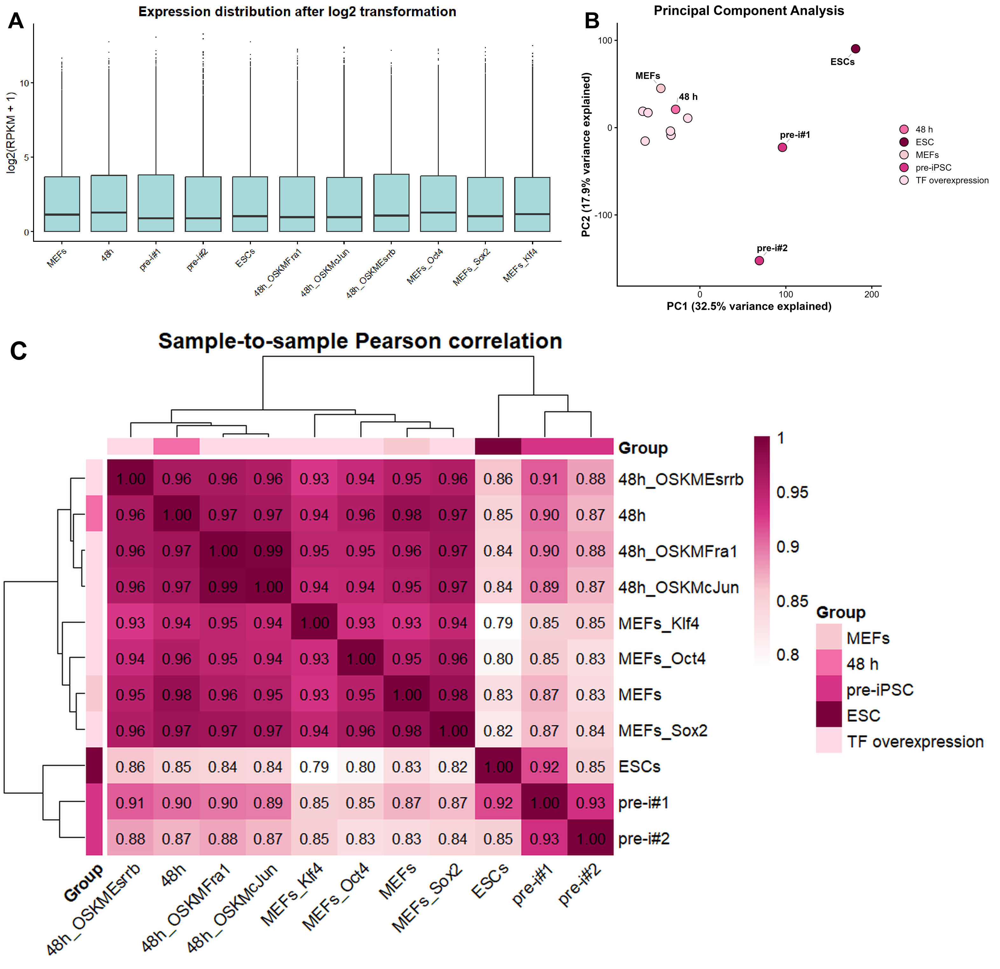
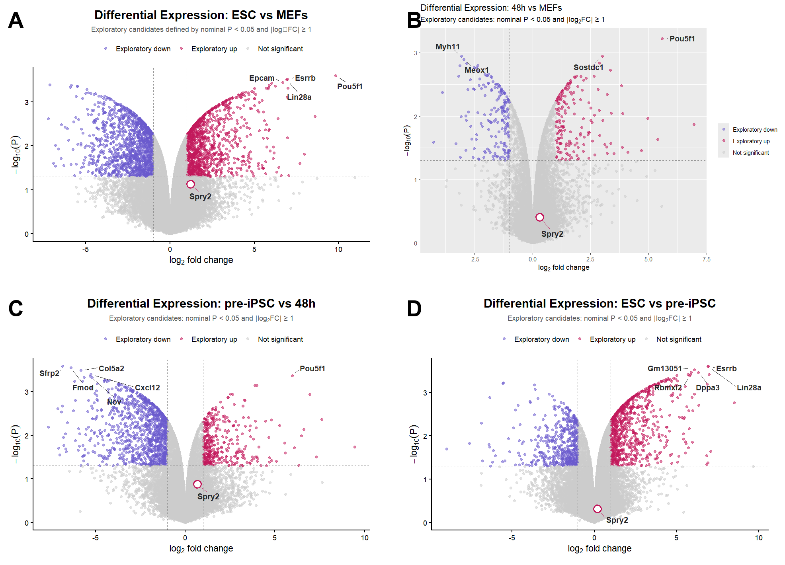
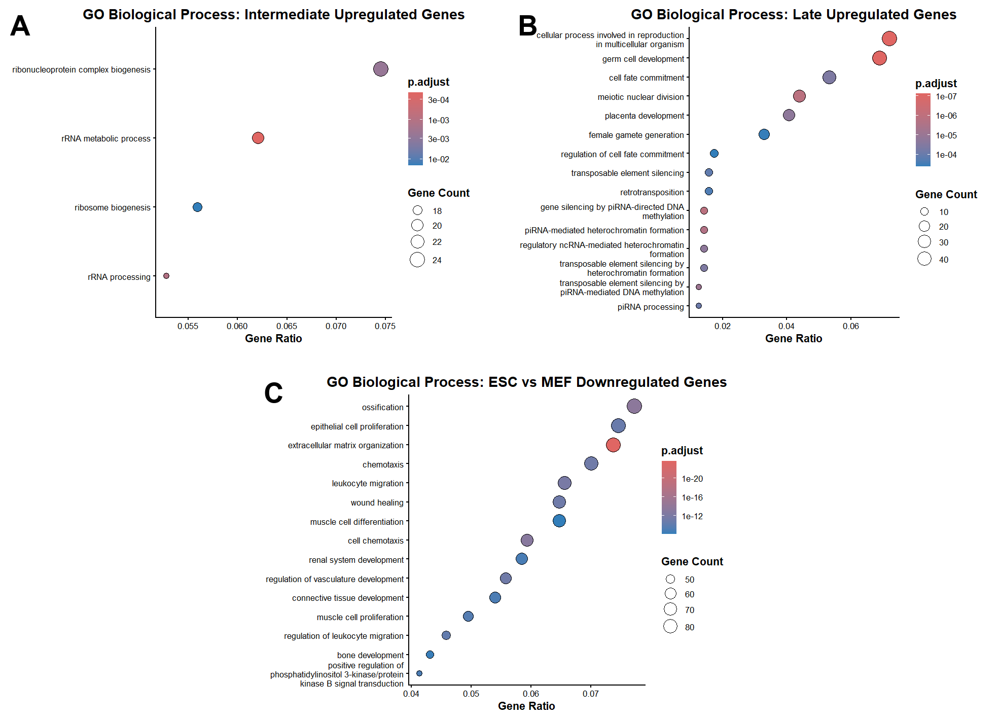
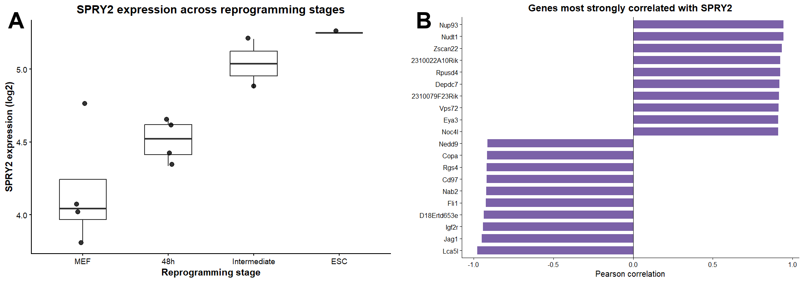
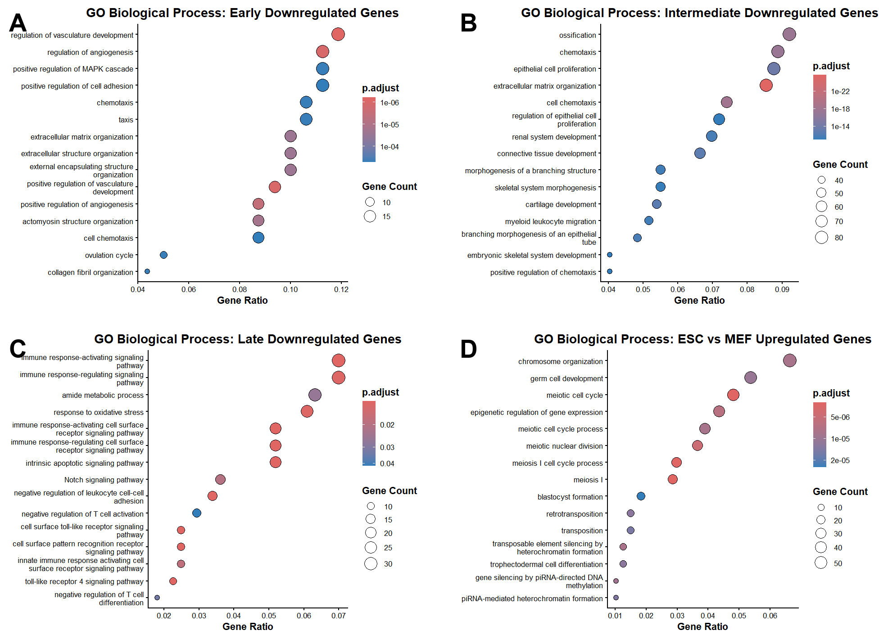
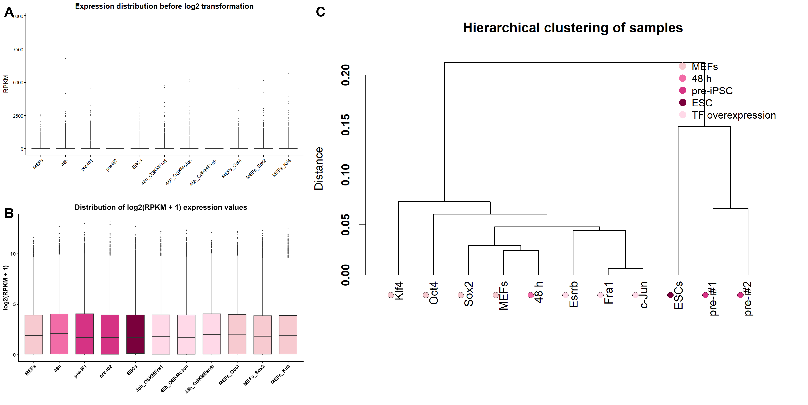
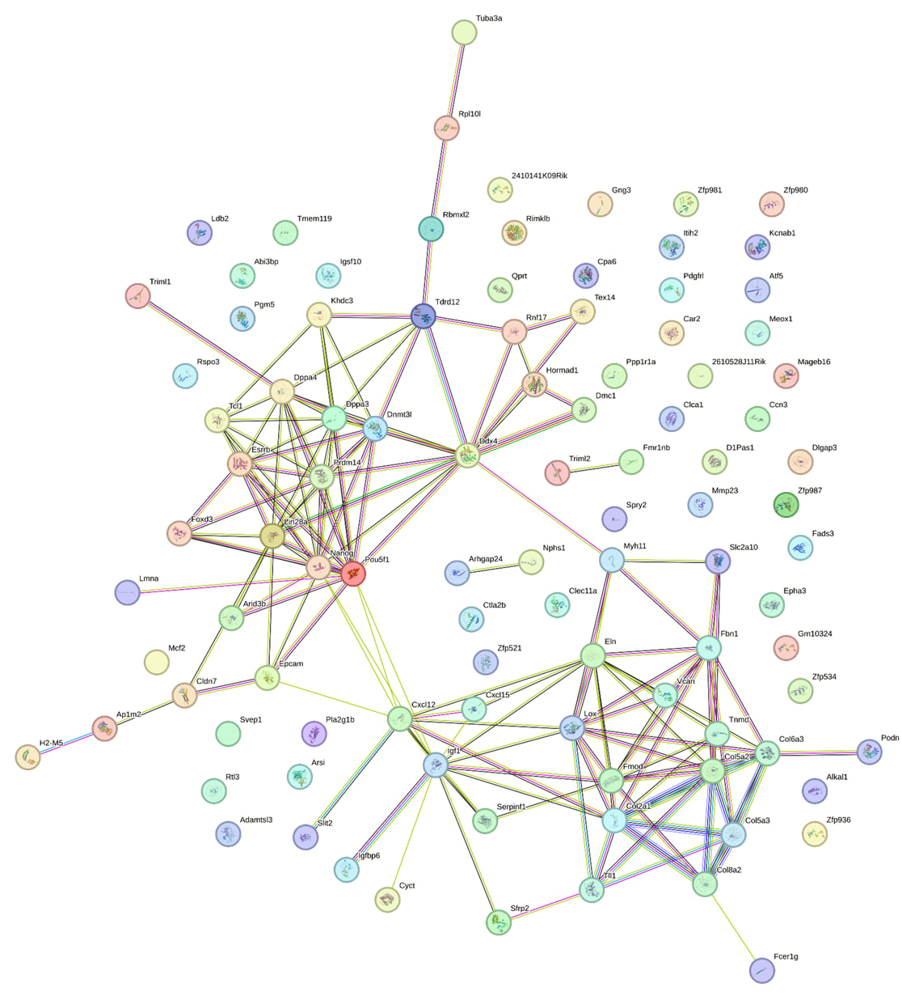

# Integrative Transcriptomic and Network Analysis of Somatic Cell Reprogramming Toward Pluripotency Highlights SPRY2 as a Candidate Gene

## Overview

This repository contains the computational analysis underlying the study *Integrative Transcriptomic and Network Analysis of Somatic Cell Reprogramming Toward Pluripotency Highlights SPRY2 as a Candidate Gene*. The study presents an integrative bioinformatic re-analysis of publicly available RNA-seq data to characterize transcriptional and functional changes during somatic cell reprogramming toward pluripotency and to investigate SPRY2 as an exploratory candidate associated with cellular plasticity and acquisition of a pluripotent state.

The analysis focuses on the reprogramming trajectory from mouse embryonic fibroblasts (MEFs) through 48 h of OSKM induction and pre-iPSC states to embryonic stem cells (ESCs). The transcriptomic data were obtained from the Gene Expression Omnibus (GEO), using the GSE90894 RNA-seq SubSeries within the GSE90895 SuperSeries.

## Study design

The primary analysis included 11 samples representing the trajectory:

**MEFs → 48 h → pre-iPSC → ESCs**

The expression matrix contained 22,608 genes across 11 samples. Expression values were transformed using log₂(RPKM + 1), followed by removal of genes with zero variance, resulting in a filtered matrix of 19,801 genes.

Four predefined pairwise contrasts were analyzed:

**48 h vs MEFs**, **pre-iPSC vs 48 h**, **ESC vs pre-iPSC**, and **ESC vs MEFs**.

## Computational analysis

The computational workflow includes transcriptomic preprocessing and quality assessment, principal component analysis, pairwise Pearson correlation, hierarchical clustering, differential expression analysis using the limma framework, and functional enrichment analysis.

Gene Ontology Biological Process, KEGG, Reactome, and Gene Set Enrichment Analysis (GSEA) were used to characterize biological processes and pathway-level changes associated with the reprogramming trajectory. SPRY2 was subsequently examined through expression analysis, correlation analysis, and STRING-based interaction analysis.

## Principal findings

The transcriptomic profiles demonstrated structured variation across the reprogramming trajectory. ESC samples formed a distinct transcriptional group, while the pre-iPSC stage showed greater heterogeneity. Principal component analysis explained 32.5% and 17.9% of the total variance along PC1 and PC2, respectively, accounting for 50.4% of the observed variation.

No genes met the predefined stringent criteria of FDR < 0.05 and |log₂FC| ≥ 1 in any of the four analyzed contrasts. Exploratory analysis using nominal P < 0.05 and |log₂FC| ≥ 1 identified 340 genes in the 48 h vs MEF comparison, 1,436 genes in pre-iPSC vs 48 h, 1,304 genes in ESC vs pre-iPSC, and 2,348 genes in ESC vs MEF. These genes were interpreted as exploratory candidates rather than statistically validated differentially expressed genes.

Functional enrichment revealed progressive suppression of extracellular matrix, collagen, adhesion, focal adhesion, integrin, cytoskeletal, and mesenchymal-associated programs during reprogramming. At intermediate stages, RNA- and ribosome-associated processes were enriched together with MYC, E2F, and G2M-related programs. Later stages showed enrichment of pluripotency-, developmental-, germ-cell-, and epigenetic-associated programs, while EMT-associated transcriptional activity was strongly depleted in the ESC–MEF comparison.

SPRY2 showed a consistent positive expression trend across the reprogramming trajectory. The largest stage-specific increase occurred during the transition from 48 h to pre-iPSC, while the strongest overall difference was observed between ESCs and MEFs (log₂FC = +1.23). This change was not statistically significant after multiple-testing correction (FDR = 0.314). SPRY2 was therefore retained as an exploratory candidate rather than a statistically significant differentially expressed gene.

Correlation analysis identified genes strongly co-varying with SPRY2 across the analyzed samples. Exploratory functional analysis of the 60 strongest positive and negative correlations identified significant Reactome enrichment for transport of mature mRNAs derived from intronless transcripts, involving Nup93, Nup62, and Cpsf4 (FDR = 0.011), whereas GO enrichment was not significant after multiple-testing correction.

## Figures

### Figure 1. Transcriptomic data quality and sample relationships

Figure 1 summarizes the global structure of the analyzed transcriptomic dataset through expression distributions, principal component analysis, and pairwise Pearson correlation.

### Figure 2. Differential expression across the reprogramming trajectory

Figure 2 presents volcano plots for the four predefined contrasts: ESC vs MEF, 48 h vs MEF, pre-iPSC vs 48 h, and ESC vs pre-iPSC. Dashed lines indicate the exploratory criteria of nominal P < 0.05 and |log₂FC| ≥ 1.

### Figure 3. Functional remodeling during somatic cell reprogramming

Figure 3 presents representative Gene Ontology Biological Process enrichment results for intermediate-stage upregulated genes, late-stage upregulated genes, and genes downregulated in ESCs relative to MEFs.

### Figure 4. SPRY2 expression and transcriptional context during somatic cell reprogramming

Figure 4 shows SPRY2 expression across the major reprogramming stages together with genes showing the strongest positive and negative correlations with SPRY2 expression across the analyzed samples.

## Supplementary figures

### Supplementary Figure S1. Additional quality control analyses

Supplementary Figure S1 provides additional expression-distribution and hierarchical-clustering analyses supporting the assessment of the transcriptomic dataset.

### Supplementary Figure S2. Additional functional enrichment analyses

Supplementary Figure S2 presents complementary Gene Ontology Biological Process enrichment analyses for additional upregulated and downregulated gene sets across the reprogramming trajectory.

### Supplementary Figure S3. STRING protein–protein interaction network

Supplementary Figure S3 presents the STRING protein–protein interaction network used to examine the interaction context of SPRY2 within the selected gene set.

## Repository organization

The repository is organized according to the major components of the computational workflow. The `data` directory contains the input and processed expression data. The `scripts` directory contains the R scripts used for data processing, quality control, differential expression, functional enrichment, network analysis, and SPRY2-focused analysis.

The `results` directory contains the main and supplementary figures generated during the analysis, as well as the STRING interaction dataset used as an external input for network analysis. The `manuscript` directory contains the scientific manuscript and related publication materials.

## Reproducibility

All analyses and visualizations reported in the study are implemented in R and organized as sequential scripts. The workflow is designed to allow the reported results and figures to be reproduced from the available input data and analysis code.

Generated intermediate files are not included unnecessarily when they can be regenerated directly by the corresponding scripts. Project-relative paths are used to avoid dependence on machine-specific file locations.

## Data and code availability

The transcriptomic data analyzed in this study were generated previously and obtained from the Gene Expression Omnibus (GEO). The present project represents a secondary computational analysis of these publicly available data and does not contain newly generated experimental data.

The original dataset remains subject to the terms and conditions of the GEO repository and the corresponding source study. The analysis scripts, documentation, and project materials developed for this study are provided under the MIT License.

## Authors

**Alina Sobolieva**  
**Khrystyna Malysheva**

Stepan Gzhytskyi National University of Veterinary Medicine and Biotechnologies Lviv

## License

This project is licensed under the MIT License. See the `LICENSE` file for details.
